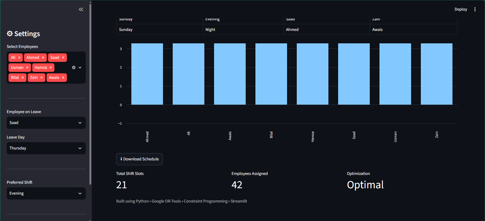
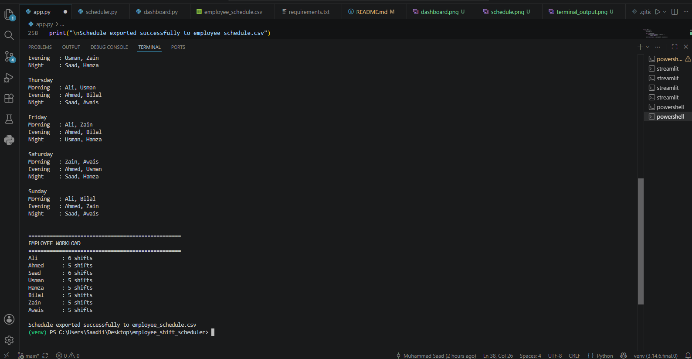

# Employee Shift Scheduler using Google OR-Tools

## Overview

This project is an employee shift scheduling system built using Google's OR-Tools Constraint Programming (CP-SAT) solver.

The scheduler automatically assigns employees to shifts while satisfying business constraints such as:

- One shift per employee per day
- Exactly two employees per shift
- Fair workload distribution (5–6 shifts per employee)

## Technologies

- Python
- Google OR-Tools
- Constraint Programming
- Operations Research

## Features

- Automatic shift scheduling
- Fair workload balancing
- Weekly schedule generation
- CSV export
- Employee workload report

## Project Structure

```
app.py
requirements.txt
README.md
employee_schedule.csv
```

## Constraints

1. One employee can work only one shift per day.
2. Each shift requires exactly two employees.
3. Every employee works between 5 and 6 shifts.

## How to Run

```bash
pip install -r requirements.txt
python app.py
```

## Sample Output

The application generates:

- Weekly employee schedule
- Employee workload summary
- CSV export

## Future Improvements

- Employee leave requests
- Night shift constraints
- Preferred shifts
- Streamlit dashboard
- Excel export

## Screenshots

### Dashboard


---

### Generated Schedule



---

### Console Output

